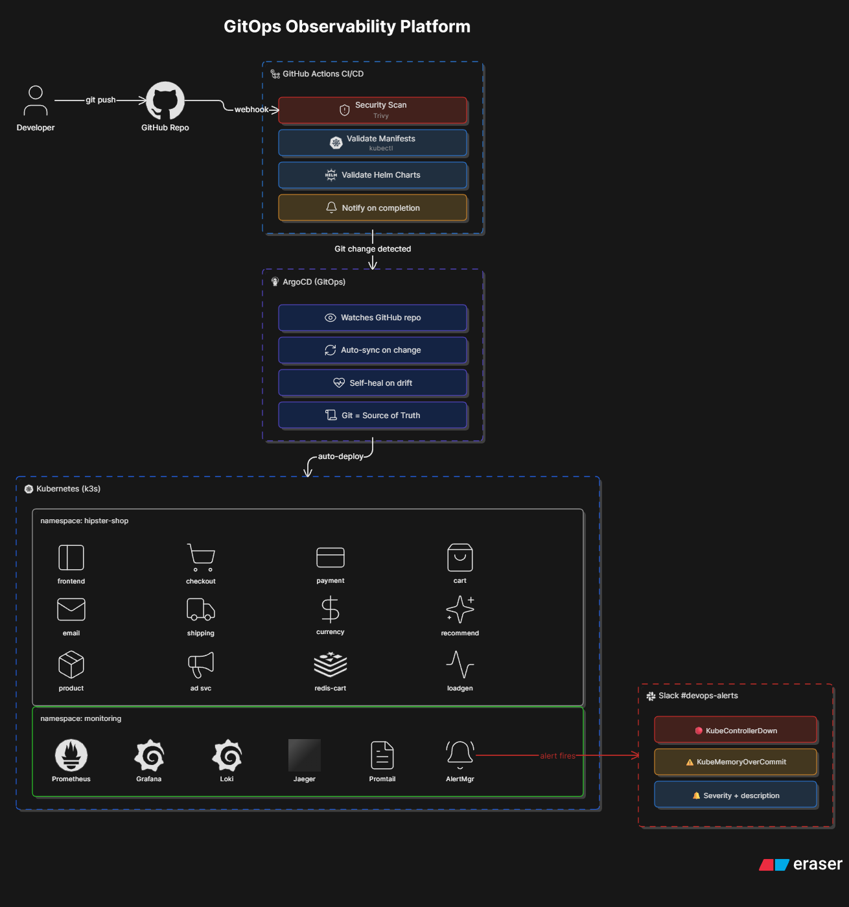
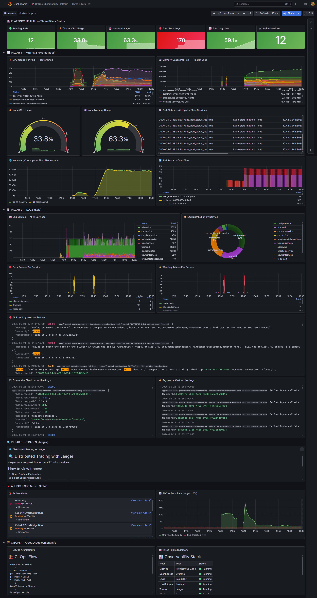
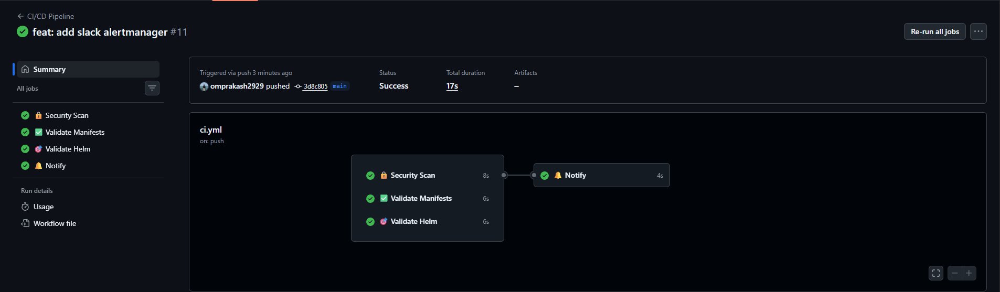
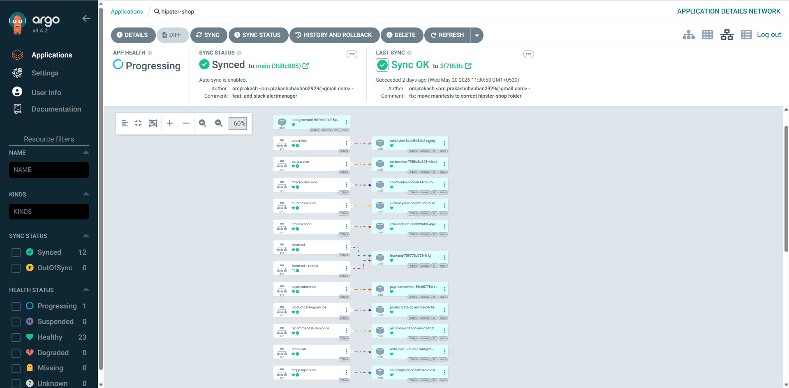
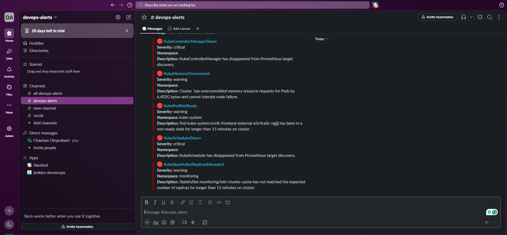

<div align="center">


# 🚀 GitOps Observability Platform

### Production-Grade Three Pillars Observability with GitOps Deployment

[](https://argo-cd.readthedocs.io)
[](https://github.com/features/actions)
[](https://prometheus.io)
[](https://grafana.com)
[](https://grafana.com/oss/loki)
[](https://jaegertracing.io)
[](https://slack.com)
[](https://k3s.io)
[](LICENSE)
[](https://github.com/omprakash2929/gitops-observability-platform)

**[📋 Overview](#-project-overview) • [🏗️ Architecture](#-architecture) • [📊 Three Pillars](#-three-pillars-of-observability) • [🔄 GitOps](#-gitops-flow) • [🚀 Setup](#-quick-start)**

</div>

---

## 📋 Project Overview

**GitOps Observability Platform** is a production-grade monitoring solution that implements the **Three Pillars of Observability** — Metrics, Logs, and Traces — across **12 microservices** of Google's Hipster Shop (Online Boutique). The platform uses **ArgoCD for GitOps deployment** and **GitHub Actions for CI/CD**, providing full visibility into a real-world cloud-native application.

> **Why this project?** Most monitoring setups only cover metrics. This platform covers all three observability pillars with real microservices, GitOps deployment, intelligent alerting, and Slack notifications — replicating what companies like Google, Netflix, and Visa use in production.

### 🎯 Key Highlights

| Feature | Details |
|---|---|
| **Target App** | Google Hipster Shop — 12 real microservices |
| **GitOps Tool** | ArgoCD v3.4.2 — auto-sync on every Git push |
| **CI/CD** | GitHub Actions — Security scan + Manifest validation |
| **Metrics** | Prometheus 3.11.3 — scraping all 12 services |
| **Logs** | Loki 3.6.7 + Promtail — 59K+ log lines collected |
| **Traces** | Jaeger — distributed tracing ready |
| **Dashboards** | Grafana — custom Three Pillars dashboard |
| **Alerting** | Alertmanager → Slack real-time alerts |
| **Alert Rules** | 5 custom PrometheusRules + 35 built-in rules |
| **Runbooks** | 5 markdown runbooks with kubectl fix commands |

---

## 🏗️ Architecture



---

## 📊 Three Pillars of Observability

### Pillar 1 — 📈 Metrics (Prometheus + Grafana)

Prometheus scrapes metrics from all 12 microservices every 30 seconds. Custom Grafana dashboard shows:

- **CPU Usage per Pod** — time series for all 12 services
- **Memory Usage per Pod** — with limit thresholds
- **Node CPU/Memory Gauges** — current: 33.8% CPU, 63.3% Memory
- **Network I/O** — receive and transmit per namespace
- **Pod Restarts** — bar chart showing restart history
- **Pod Status Table** — ready state of all services

> 📸 **Screenshot:** Grafana Three Pillars Dashboard



---

### Pillar 2 — 📋 Logs (Loki + Promtail)

Promtail ships logs from all pods to Loki. Grafana Loki panels show:

- **Total Error Logs:** 170 errors tracked
- **Total Log Lines:** 59.1K lines collected
- **Log Volume Chart** — per service over time
- **Log Distribution** — donut chart by service
- **Error Rate** — checkout, frontend, redis-cart
- **Live Log Streams** — Frontend, Checkout, Payment, Cart

> Real transaction logs visible: payment processing, order placement, API calls

---

### Pillar 3 — 🔍 Traces (Jaeger)

Jaeger deployed for distributed tracing across all 12 microservices. Ready for OpenTelemetry instrumentation.

```
Access: http://VM_IP:16686
Services: frontend, checkoutservice, paymentservice
```

---

## 🔄 GitOps Flow

### GitHub Actions CI/CD Pipeline

Every `git push` to `main` triggers:

```
Push → GitHub Actions
  ├── 🔒 Security Scan (Trivy) — 6s
  ├── ✅ Validate Manifests     — 6s  
  ├── 🎯 Validate Helm Charts   — 6s
  └── 🔔 Notify                 — 4s
Total: 17s
```

> 📸 **Screenshot:** GitHub Actions — All Green



### ArgoCD Auto-Sync

ArgoCD watches the GitHub repo and automatically deploys on any change:

```
Git Push → ArgoCD detects change
        → Validates manifests
        → Applies to k3s cluster
        → Self-heals on drift
        → Rollback with: git revert
```

**Current Status:**
- Sync Status: ✅ Synced to main
- Health: Progressing (12 pods running)
- Resources: 35 synced, 0 OutOfSync
- Auto-sync: Enabled with self-heal

> 📸 **Screenshot:** ArgoCD — Hipster Shop Synced



---

## 🚨 Alerting

### Prometheus Alert Rules (Custom)

5 custom alert rules created for Hipster Shop:

| Alert | Severity | Condition | Runbook |
|---|---|---|---|
| PodCrashLoopBackOff | 🔴 Critical | Restart rate > 0 for 5m | [runbook](runbooks/pod-crash-loop.md) |
| HighMemoryUsage | 🟡 Warning | Memory > 85% for 5m | [runbook](runbooks/high-memory.md) |
| PodNotRunning | 🔴 Critical | Phase != Running for 2m | [runbook](runbooks/pod-not-running.md) |
| HighCPUThrottling | 🟡 Warning | Throttle > 25% for 5m | [runbook](runbooks/high-cpu.md) |
| PodOOMKilled | 🔴 Critical | OOMKilled immediately | [runbook](runbooks/oom-killed.md) |

### Slack Notifications

Alertmanager routes all alerts to `#devops-alerts` Slack channel with:
- Alert name + severity color
- Namespace + pod name
- Description of the issue
- Direct runbook link

> 📸 **Screenshot:** Slack — Real Alerts



**Real alerts received:**
- 🔴 KubeControllerManagerDown — critical
- ⚠️ KubeMemoryOvercommit — warning
- ⚠️ KubePodNotReady — warning
- 🔴 KubeSchedulerDown — critical
- ⚠️ KubeStatefulSetReplicasMismatch — warning

---

## 📁 Repository Structure

```
gitops-observability-platform/
│
├── 📁 .github/
│   └── 📁 workflows/
│       └── 📄 ci.yml                    ← GitHub Actions pipeline
│
├── 📁 apps/
│   └── 📁 hipster-shop/
│       └── 📄 kubernetes-manifests.yaml ← 12 microservices (ArgoCD deploys)
│
├── 📁 k8s/
│   └── 📄 argocd-app.yaml              ← ArgoCD Application definition
│
├── 📁 monitoring/
│   ├── 📄 alert-rules.yaml             ← 5 custom PrometheusRules
│   ├── 📁 alertmanager/
│   │   └── 📄 config.yaml              ← Slack webhook config
│   └── 📁 grafana/
│       └── 📁 dashboards/
│           └── 📄 ultimate-observability-dashboard.json
│
├── 📁 runbooks/
│   ├── 📄 pod-crash-loop.md
│   ├── 📄 high-memory.md
│   ├── 📄 pod-not-running.md
│   ├── 📄 high-cpu.md
│   └── 📄 oom-killed.md
│
└── 📄 README.md
```

---

## 🛠️ Tech Stack

| Category | Tool | Version | Purpose |
|---|---|---|---|
| **GitOps** | ArgoCD | v3.4.2 | Auto-deploy from Git |
| **CI/CD** | GitHub Actions | latest | Security scan + validation |
| **Cluster** | k3s | v1.35.4 | Lightweight Kubernetes |
| **Target App** | Hipster Shop | latest | 12 Google microservices |
| **Metrics** | Prometheus | 3.11.3 | Time-series metrics |
| **Dashboards** | Grafana | latest | Visualization |
| **Logs** | Loki | 3.6.7 | Log aggregation |
| **Log Agent** | Promtail | latest | Log shipping |
| **Traces** | Jaeger | latest | Distributed tracing |
| **Alerting** | Alertmanager | latest | Alert routing |
| **Notifications** | Slack | - | Real-time alerts |
| **Security** | Trivy | latest | CVE scanning in CI |

---

## 🚀 Quick Start

### Prerequisites

```bash
# Required
kubectl version    # v1.35+
helm version       # v3.20+
docker --version   # 29.x+
```

### 1. Clone Repository

```bash
git clone https://github.com/omprakash2929/gitops-observability-platform
cd gitops-observability-platform
```

### 2. Install k3s

```bash
curl -sfL https://get.k3s.io | sh -
mkdir -p ~/.kube
sudo cp /etc/rancher/k3s/k3s.yaml ~/.kube/config
kubectl get nodes
```

### 3. Install ArgoCD

```bash
kubectl create namespace argocd
kubectl apply -n argocd -f \
  https://raw.githubusercontent.com/argoproj/argo-cd/stable/manifests/install.yaml

# Get admin password
kubectl -n argocd get secret argocd-initial-admin-secret \
  -o jsonpath="{.data.password}" | base64 -d

# Access UI
kubectl port-forward svc/argocd-server 8090:443 -n argocd --address 0.0.0.0
# Open: https://VM_IP:8090
```

### 4. Deploy Hipster Shop via ArgoCD

```bash
kubectl apply -f k8s/argocd-app.yaml
# ArgoCD auto-deploys all 12 microservices!
kubectl get pods -n hipster-shop
```

### 5. Install Monitoring Stack

```bash
# Add Helm repos
helm repo add prometheus-community https://prometheus-community.github.io/helm-charts
helm repo add grafana https://grafana.github.io/helm-charts
helm repo update

# Prometheus + Grafana + Alertmanager
kubectl create namespace monitoring
helm install monitoring prometheus-community/kube-prometheus-stack \
  --namespace monitoring \
  --set grafana.adminPassword=admin123 \
  --set prometheus.prometheusSpec.serviceMonitorSelectorNilUsesHelmValues=false

# Loki + Promtail
helm install loki grafana/loki \
  --namespace monitoring \
  --set loki.auth_enabled=false \
  --set deploymentMode=SingleBinary \
  --set loki.useTestSchema=true

helm install promtail grafana/promtail \
  --namespace monitoring \
  --set config.clients[0].url=http://loki-gateway.monitoring.svc.cluster.local/loki/api/v1/push

# Jaeger
helm repo add jaegertracing https://jaegertracing.github.io/helm-charts
helm install jaeger jaegertracing/jaeger \
  --namespace monitoring \
  --set allInOne.enabled=true \
  --set storage.type=memory
```

### 6. Access All Services

```bash
# Start all port-forwards
kubectl port-forward svc/monitoring-grafana 3000:80 -n monitoring --address 0.0.0.0 &
kubectl port-forward svc/prometheus-operated 9090:9090 -n monitoring --address 0.0.0.0 &
kubectl port-forward svc/jaeger 16686:16686 -n monitoring --address 0.0.0.0 &
kubectl port-forward svc/argocd-server 8090:443 -n argocd --address 0.0.0.0 &
```

| Service | URL | Credentials |
|---|---|---|
| Grafana | http://VM_IP:3000 | admin / admin123 |
| Prometheus | http://VM_IP:9090 | - |
| Jaeger | http://VM_IP:16686 | - |
| ArgoCD | https://VM_IP:8090 | admin / auto-generated |

### 7. Import Grafana Dashboard

```
Grafana → + → Import → Upload JSON file
→ monitoring/grafana/dashboards/ultimate-observability-dashboard.json
→ Select Prometheus + Loki + Jaeger datasources
→ Import
```

### 8. Apply Alert Rules

```bash
kubectl apply -f monitoring/alert-rules.yaml
kubectl get prometheusrule -n monitoring | grep hipster
```

---

## 📈 Results & Metrics

| Metric | Value |
|---|---|
| **Microservices monitored** | 12 services |
| **Prometheus targets** | 12+ UP |
| **Log lines collected** | 59.1K+ |
| **Error logs tracked** | 170 |
| **Custom alert rules** | 5 rules |
| **Total PrometheusRules** | 40+ (35 built-in + 5 custom) |
| **Runbooks created** | 5 markdown files |
| **ArgoCD synced resources** | 35 resources |
| **GitHub Actions runs** | 11 runs (all passing) |
| **Slack alerts received** | 5+ real alerts |

---

## 🎓 What I Learned

- Implementing GitOps with ArgoCD — Git as single source of truth for Kubernetes deployments
- Building Three Pillars observability from scratch — metrics, logs, and traces together
- Writing custom Prometheus alert rules with SLO-based thresholds and runbook annotations
- Configuring Alertmanager routing with Slack webhook for real-time incident notifications
- Setting up Loki + Promtail log aggregation pipeline across multiple namespaces
- Creating production-grade Grafana dashboards with multiple datasources
- Designing CI/CD with GitHub Actions — security scanning and manifest validation
- Debugging real Kubernetes issues — pod restarts, memory overcommit, StatefulSet replicas
- Understanding the difference between GitOps CD (ArgoCD) and traditional CI (GitHub Actions)

---

## 🔮 Future Improvements

- [ ] Add OpenTelemetry instrumentation to Hipster Shop for real Jaeger traces
- [ ] Implement SLO dashboards with error budget burn rate alerts
- [ ] Add Blackbox Exporter for endpoint uptime monitoring
- [ ] Integrate AI-powered root cause analysis (Claude API + Python FastAPI)
- [ ] Add network policies for pod-to-pod security
- [ ] Implement multi-cluster observability with Thanos
- [ ] Add log-based alerting with Loki ruler

---

## 👨‍💻 Author

**Omprakash Chauhan**

[](https://linkedin.com/in/omprakash-chauhan-07b1b3233)
[](https://github.com/omprakash2929)
[](https://omprakashchauhan.tech)

---

<div align="center">

**⭐ Star this repo if you found it helpful!**

*Built with ❤️ — GitOps + Three Pillars Observability Portfolio Project*

</div>
## Badges
